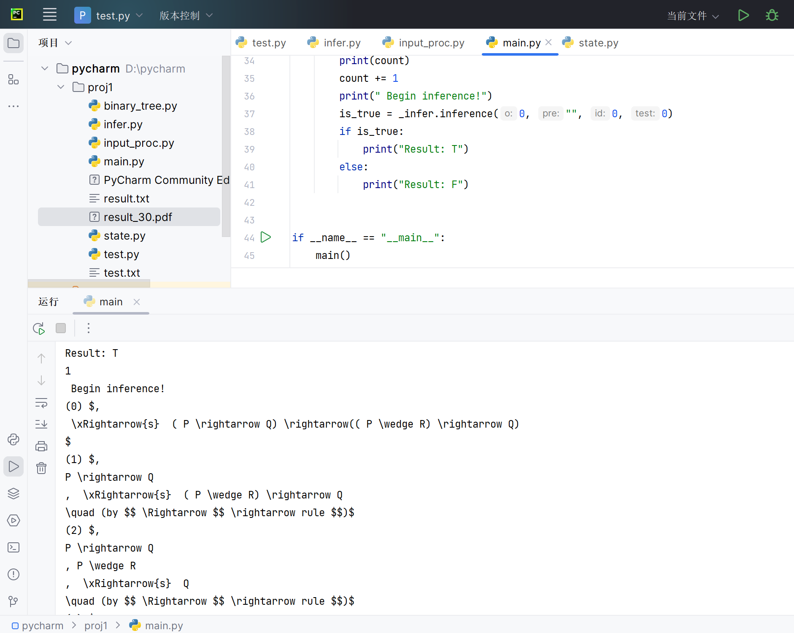

# Wang Hao Algorithm Lab

实现命题逻辑自动推理证明


### 清华大学学生纪律处分管理规定实施细则

#### 第六章　学术不端、违反学习纪律的行为与处分

第二十一条 有下列违反课程学习纪律情形之一的，给予警告以上、留校察看以下处分：

（一）课程作业抄袭严重的；

（二）实验报告抄袭严重或者篡改实验数据的；

（三）期中、期末课程论文抄袭严重的；

（四）在课程学习过程中严重弄虚作假的其他情形。

This project implements Wang Hao's algorithm for logical expression inference. It includes features such as converting infix expressions to postfix expressions, constructing expression binary trees, and performing inference based on Wang Hao's algorithm.

## Project Structure

```txt
├── main.py          # Program entry point
├── input_proc.py    # Input processing functions
├── binary_tree.py   # Constructing expression binary trees
├── state.py         # Storing logical connectives
├── infer.py         # Implementation of Wang Hao's algorithm (10 inference rules + 1 axiom)
├── test.py          # Test script
├── test.txt         # Test cases
├── result.txt       # Inference result text file
└── result.pdf       # PDF exported from Typora after copying the first 30 inference results from the txt file
```



## Features

### 1. Infix to Postfix Conversion
Converts input infix expressions to Reverse Polish Notation (postfix expressions) using a stack structure to handle operator precedence.

### 2. Expression Binary Tree Construction
Builds expression binary trees from postfix expressions, implementing operations such as tree creation, insertion, deletion, and traversal.

### 3. Inference Using Wang Hao's Algorithm
Performs logical inference based on Wang Hao's algorithm, supporting 10 inference rules and 1 axiom. It outputs the inference steps and results.

## Implementation Approach

### 2.1 Input Processing
1. **Infix to Postfix Conversion**:
   - Uses a stack structure to handle operator precedence.
   - Algorithm flow:
     1. Initialize the result list `res` and stack `stk` as empty.
     2. Iterate through each character `t` in the input:
        - If `t` is an operand, add it to `res`.
        - If `t` is an operator, pop operators from the stack to `res` while the top operator has higher or equal precedence than `t`, then push `t` onto the stack.
        - If `t` is `(`, push it onto the stack.
        - If `t` is `)`, pop operators from the stack to `res` until `(` is encountered, then pop `(` from the stack.
     3. After processing all characters, pop any remaining operators from the stack to `res`.

2. **Binary Tree Construction**:
   - Converts the postfix expression into a binary tree for expression storage.
   - Algorithm flow:
     1. Initialize an empty stack `stk`.
     2. For each value in the input:
        - Create a new node `node` with the value.
        - If the value starts with `'\\u2019'` (indicating a right child):
          - Set `node.right` to the node popped from `stk`.
        - If `stk` is not empty:
          - Set `node.left` to the node popped from `stk`.
        - Push `node` onto `stk`.
     3. If the length of `stk` is 1, return `True` (indicating a valid tree).

### 2.2 Inference Using Wang Hao's Algorithm
1. Instantiate the `Inference` class with an empty list of premises (`LHS`) and a list of conclusions (`RHS`) containing the target expression binary tree.
2. Perform inference based on Wang Hao's algorithm:
   - Algorithm flow:
     1. Initialize a counter `cnt` to 0.
     2. While `True`:
        - Print the current inference step.
        - For each node `v` in `LHS`:
          - If `v.root.value[0]` indicates a specific operation:
            - Extract the operation code `o` from `v.root.value[1]`.
            - If `o` is 1:
              - Append the right subtree of `v.root` to `RHS`.
            - Else if `o` is 2:
              - Append the right and left subtrees of `v.root` to `LHS`.
            - Remove `v` from `LHS`.
        - For each node `v` in `RHS`:
          - If `v.root.value[0]` indicates a specific operation:
            - Extract the operation code `o` from `v.root.value[1]`.
            - If `o` is 1:
              - Append the right subtree of `v.root` to `LHS`.
            - Else if `o` is in {3, 4}:
              - Append the right subtree of `v.root` to `RHS`.
              - If `o` is 4:
                - Append the left subtree of `v.root` to `LHS`.
            - Remove `v` from `RHS`.
        - If common trees are found in both `LHS` and `RHS`, return `True`.

### 2.3 Data Structures
- `BinaryTree` class:
  - Attributes:
    - `root`: The root node of the binary tree.
    - `nodes`: List of nodes in the tree.
    - `L`: List of left children.
    - `R`: List of right children.
    - `_input`: Input expression.
    - `is_valid`: Boolean indicating whether the tree is valid.
  - Methods:
    - `init_tree()`: Initializes the binary tree from the input expression.

- `Inference` class:
  - Attributes:
    - `rules`: List of inference rules.
    - `cnt`: Inference step counter.
    - `LHS`: List of premise expression trees.
    - `RHS`: List of conclusion expression trees.
    - `nodes`: List of nodes involved in inference.
    - `class_tree`: Instance of the `BinaryTree` class.
  - Methods:
    - `__init__(l, r, class_tree_instance, rules)`: Initializes the inference process with premises `l`, conclusions `r`, and the binary tree instance.


## Acknowledgements

This project references the book "Mathematical Logic and Set Theory" (2nd Edition).